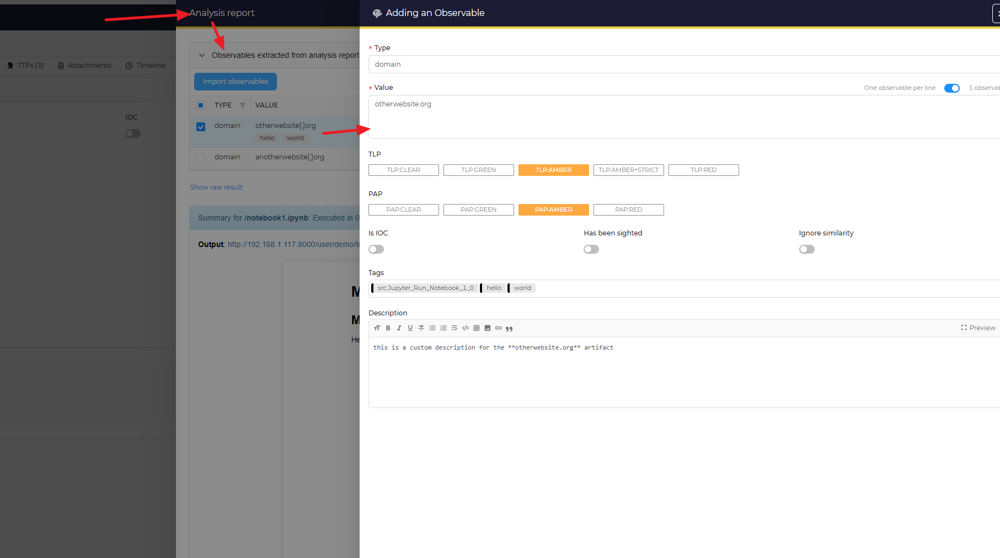
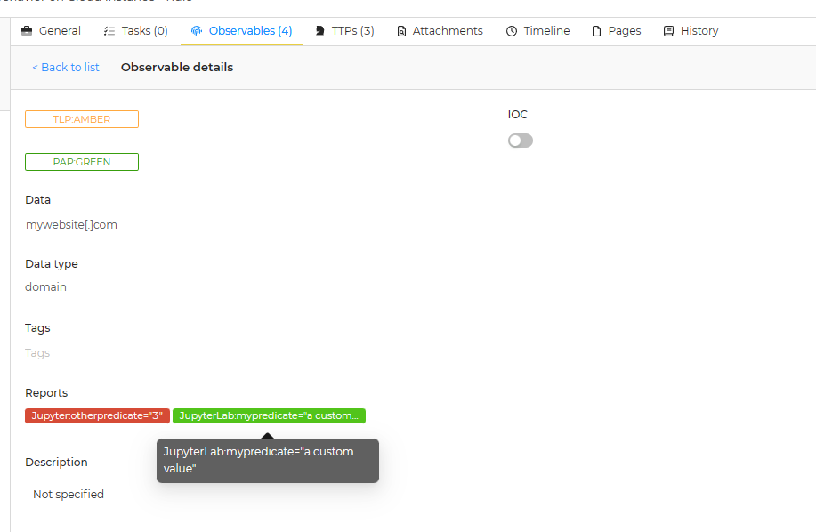

# Summary

This analyzer allows you to execute a parametrized notebook in Jupyter. This can help you investigate observables by submitting them to custom notebooks for automated investigation tasks.
You can choose to execute your notebooks locally or remotely.

This was designed to run with a running remote JupyterHub instance but you can work directly with local/remote storages (Azure, S3 etc.)

You can run several notebooks at the same time for one observable.

You can setup several Jupyter connectors just with a copy/paste of the file "Jupyter_Run_Notebook.json" file.

# Prerequisites

## Cortex connector

You must install the required librairies described in the requirements.txt file.

### You are using HTTP Handlers

> ⚠️ A current issue was identified in the [Papermill](https://github.com/nteract/papermill) on how the requests are managed when HTTP handler is used. The Jupyter HTTP REST API is adding an additionnal layer in the JSON response that need to be removed before recovering the notebook. An issue was raised accordingly:
[Nbformat/nbformat_minor not well extracted with HTTP handler #727](https://github.com/nteract/papermill/issues/727)

You can fix the issue by replacing the HTTPHandler class in [papermill source code (iorw.py#L180)](https://github.com/nteract/papermill/blob/3ad2dacbf539967cfed46bfa8516afbb8a120849/papermill/iorw.py#L180) to this code:

```diff
class HttpHandler(object):
    @classmethod
    def read(cls, path):
-        return requests.get(path, headers={'Accept': 'application/json'}).text
+        return json.dumps(requests.get(path, headers={'Accept': 'application/json'}).json()["content"])

    @classmethod
    def listdir(cls, path):
        raise PapermillException('listdir is not supported by HttpHandler')

    @classmethod
    def write(cls, buf, path):
+        payload = {"type": "notebook", "format": "json", "path": path}
+        payload["content"] = buf
+        result = requests.put(path, json=json.loads(payload))
-        result = requests.put(path, json=json.loads(buf))
        result.raise_for_status()

    @classmethod
    def pretty_path(cls, path):
        return path
```

## JupyterHub

You must create a service account to access the JupyterHub instance.
This is a proposed configuration:

```yaml
c.JupyterHub.load_roles = [
    {
        "name": "role_cortex_servers",
        "scopes": [
            "servers",  # manage servers
            "access:servers",  # access servers themselves
        ],
        # assign role to our 'cortex' service
        "services": ["cortex"],
    }
]

# persist token to a file, to share it with the launch-server.py script
import pathlib
import secrets

here = pathlib.Path(__file__).parent
token_file = here.joinpath("service-token-cortex")
if token_file.exists():
    with token_file.open("r") as f:
        token = f.read()
else:
    token = secrets.token_hex(16)
    with token_file.open("w") as f:
        f.write(token)

# define our service
c.JupyterHub.services = [
    {
        "name": "cortex",
        "api_token": token,
    }
]
```

A token will be available locally to your JupyterHub instance under the file named "service-token-cortex"

You must enable the named servers by adding this into your configuration:
```yaml
c.JupyterHub.allow_named_servers = True
```


# Technical details

## Local execution of your notebooks

This connector is using the [Papermill](https://github.com/nteract/papermill) library to work. It will allow you to get the notebook, execute it locally after parameterize the notebook and then store it.
Please refer to the [Supported Name Handles](https://github.com/nteract/papermill#supported-name-handlers) description to have more details.

## Remote execution of your notebooks

[Papermill](https://github.com/nteract/papermill) is also used in this case but additional code (specific to this connector) was added to let you work with remote JupyterHun instance instead of having the notebooks run locally on the Cortex instance. This should help you to avoid having to install local dependencies on your Cortex instance.

To do so, the connector is communicating directly with the remote kernel using the [Jupyter HTTP REST API](https://jupyter-server.readthedocs.io/en/latest/developers/rest-api.html) and [Jupyter Websocket API](https://jupyter-kernel-gateway.readthedocs.io/en/latest/websocket-mode.html) so you must use HTTP handlers accordingly (with the provided fix above applied). It's sending automatically the code to execute following the kernel logic explained here: [Messaging in Jupyter](https://jupyter-client.readthedocs.io/en/latest/messaging.html). 

You must use HTTP handlers provided by [Papermill](https://github.com/nteract/papermill), meaning that input notebooks must be starting with "http://" or "https://" and allow traffic using the websocket protocol ("ws://").

# How to use

## Configure the connector

You'll have to setup several parameters for the connector.
Parameters can be identified with:

- `[INPUT]`: Concerns only input notebooks
- `[OUTPUT]`: Concerns only output notebooks
- `[ANY]`: Concerns either an input or output notebooks
- `[HTTP Handler]`: Need to be setup only if you are using HTTP Handlers. Not used for local/remote storage (Azure, S3 etc)

Here is the description for each parameter:

 - `input_hostname`: [INPUT] Hostname representing the Jupyter(Hub) instance (or Azure, S3 etc location) to reach to get the input notebook. See https://github.com/nteract/papermill#supported-name-handlers for more information.
 - `input_handler_http_service_api_token`: [HTTP Handler] If you want to use the REST API to get the input notebook, you must indicate an API token used by a dedicated service, otherwise don't take this parameter into account
 - `input_handler_http_is_jupyterhub`: [INPUT][HTTP Handler] If you want to use the REST API to get the input notebook, you must indicate if you're behind a JupyterHub instance or not, otherwise don't take this parameter into account (Default: true)
 - `input_handler_http_execute_remotely`: [INPUT][HTTP Handler] If you want to use the REST API to get the input notebook, you must indicate if you want to run your code locally (papermill) or remotely (websocket through HTTP), otherwise don't take this parameter into account
 - `input_paths`: [INPUT] List of paths of the notebooks you want to run
 output_hostname: [OUTPUT] Hostname representing the Jupyter(Hub) instance (or Azure, S3 etc location) to reach to store the output notebook. See https://github.com/nteract/papermill#supported-name-handlers for more information. **Input paths must start with a "/"**.
 - `output_handler_http_service_api_token`: [HTTP Handler] If you want to use the REST API to store the output notebook, you must indicate an API token used by a dedicated service, otherwise don't take this parameter into account
 - `output_handler_http_is_jupyterhub`: [OUTPUT][HTTP Handler] If you want to use the REST API to store the output notebook, you must indicate if you're behind a JupyterHub instance or not, otherwise don't take this parameter into account (Default: true)
 - `output_folder`: [OUTPUT] Folder path in which executed notebooks will be stored. **Output folder must start and end with a "/"**. (Default: /)
 - `any_handler_http_user`: [ANY][HTTP Handler] If you want to use the REST API directly (HTTP handler), you must indicate which user will be used as the reference for having the original notebooks, otherwise don't take this parameter into account.
 - `any_only_html`: [ANY] Indicates if you want only the HTML conversion as a response (not the full detailed payload) (Default: true)

## Run the connector

### Inputs

As we are using [Papermill](https://github.com/nteract/papermill), we can parameterize the notebooks before execution.
The connector will recover the input playbook, find the associated tagged cell with "parameters" and add these four parameters:

- `thehive_organisation`: This is specifying the organisation in which the connector was executed
- `thehive_user`: This is specifying which user executed the connector
- `thehive_obversable_type`: This is indicating the observable type (from the predefined list from TheHive)
- `thehive_observable_value`: This is indicating the observable value

Here is an example of what it look like:


An analysis report (notebook execution exported in HTML) wil be available in TheHive:


### Outputs

#### Artifacts

You can return new artifacts/observables from the notebook to TheHive by using a tag named "`artifacts`" on the code block that will contain the artifacts.


Once you've add the tag to the block, ensure that the code block is given json outputs containing information about new artifacts to return. As you can see, you can have several artifacts separated by a newline ("/n"). In this example, we are returning two artifacts.

Within TheHive, you'll be able to see the artifacts proposed to be imported and with the given information:



#### Short reports (taxonomies)

Short reports can be built directly from the executed notebooks as artifacts thanks to the tag named "`taxonomies`".


Once you've add the tag to the block, ensure that the code block is given json outputs containing information about taxonomies to return. As you can see, you can have several taxonomies separated by a newline ("/n"). In this example, we are returning two taxonomies.




All taxonomies must follow the same pattern:

- `level`: Indicates the level of the taxonomy (used for the color). Values can be "info", "safe", "suspicious" or "malicious".
- `namespace`: Indicates the namespace of the taxonomy. We recommand to use the default value set to "Jupyter".
- `predicate`: Indicates a specific subname for the given namespace.
- `value`: Indicates the value associated to the predicate.


#### Long report

The long report template is used to render the notebook execution from a HTML export of the same notebook. In the raw data sent back to TheHive, you can have the all detail of the execution additionally to the HTML embedded code (be sure to set `any_only_html` to False accordingly)

# FAQ

## I'm getting this error: `jupyter_client.kernelspec.NoSuchKernel: No such kernel named python3` on the Cortex instance

This means that you are missing librairies on your local Cortex instance to be able to run your notebooks. It must have a dedicated folder for the cortex user with the kernel spec to be able to run it.
You have to execute those commands on the Cortex instance to fix the issue:

```console
root#> mkdir /home/cortex
root#> chown cortex: /home/cortex
root#> su cortex
cortex#> ipython kernel install --name "python3" --user
 ```

You can reach the developer directly by email: letmer00t@gmail.com